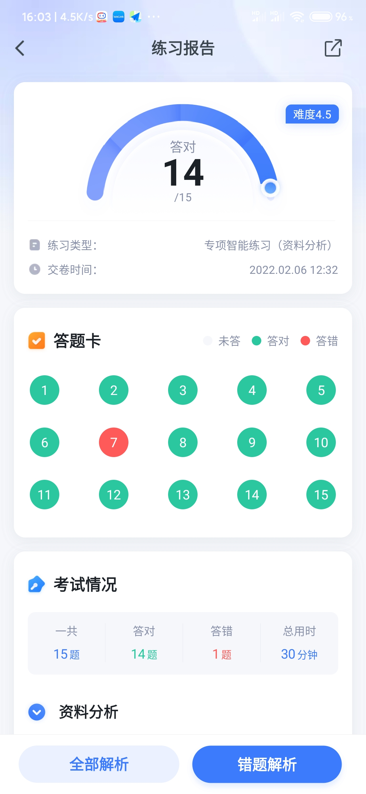
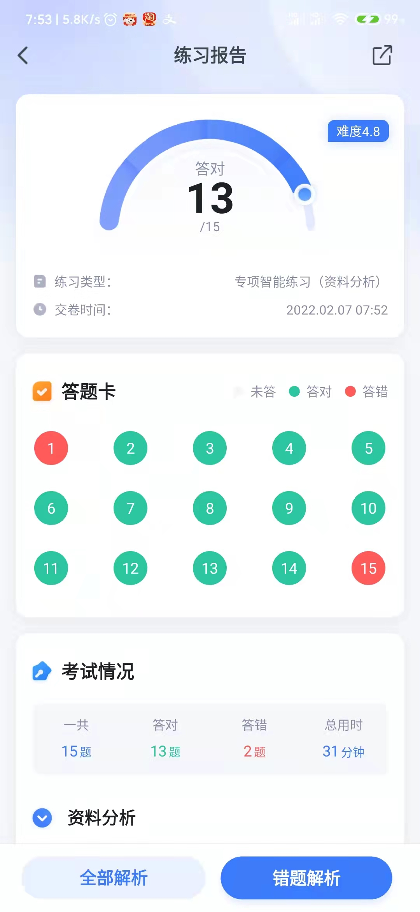
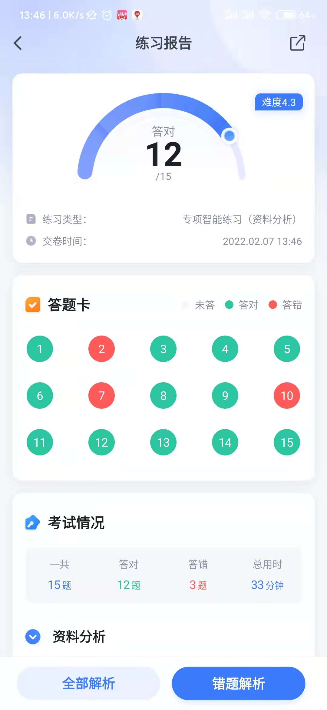
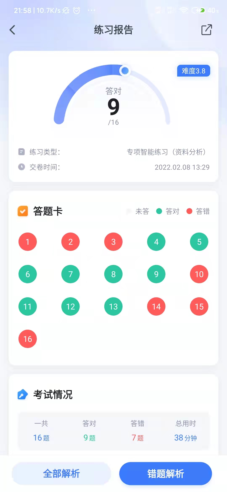
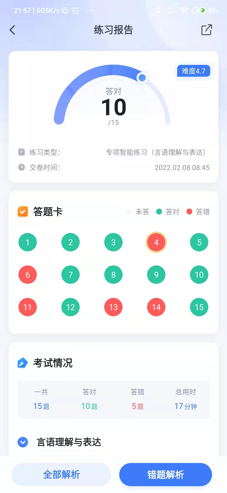
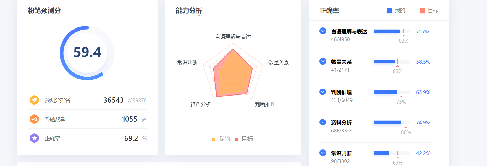
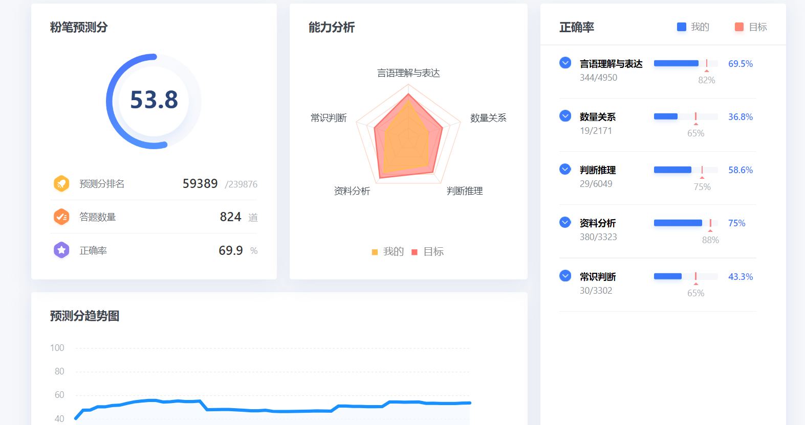
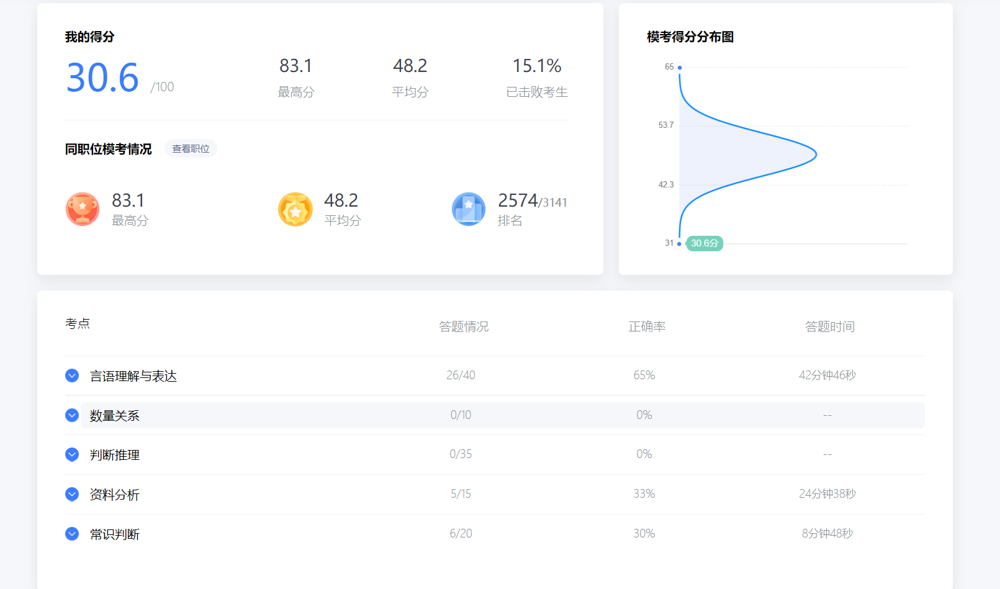

# 2022年学习记录

## 一、重要考试时间节点：

- **省考时间**：                  **2022年3 月26日**     倒计时：60天

- **三支一扶考试时间**:     **2022年5-6月**

- **事业编考试时间**：      **2022年6-7月**

## 二、学习计划

### 2022-01-17 至 2022-01-23：

#### 视频课程任务

- [x] 方法精讲-言语1.mp4   :blush:
- [x] 方法精讲-言语2.mp4   :blush:
- [x] 方法精讲-言语3.mp4   :blush:
- [x] 方法精讲-言语4.mp4  :blush:
- [ ] ~~方法精讲-言语5.mp4~~
- [ ] ~~方法精讲-言语6.mp4~~

#### 资料分析刷题

- [ ]  :date: 2022-01-17 资料分析
- [ ]  :date: 2022-01-18 资料分析
- [x]  :date: 2022-01-19 资料分析     难度: 4.5      正确率: 9/15        用时:  34分钟
- [x]  :date: 2022-01-20 资料分析     难度: 4.4      正确率: 13/15      用时:  36分钟 
- [x]  :date: 2022-01-21 资料分析     难度: 4.9      正确率:  4/15       用时:  45分钟
- [x]  :date: 2022-01-22 资料分析     难度: 4.2       正确率 12/15      用时:  39分钟
- [x]  :date: 2022-01-23 资料分析     难度: 4.4       正确率 16/18      用时:  39分钟

#### 资料分析错题分析

##### 2022-01-22 错题分析  : 

 地址: https://spa.fenbi.com/tiku/report/exam/solution/xingce/xingce/1545323806/2
 总结:  
 1. 主要是读题不认真小于看成了大于 
 2. 读题看反了是15年比14年,不是14年比15年
 3. 两个部分的增长率求总体的增长率这种题型还是不会【遇到时候着重总结】

##### 2022-01-22 错题分析  : 
地址: https://spa.fenbi.com/tiku/report/exam/solution/xingce/xingce/1546006573/2
总结:
1. 还是由于开始粗心，没有读全题目就进行秒选了
2. 混合增长率的问题还是不太明天

#### 2022-01-23 复盘
1. 时间利用效率极低，例如早上10点才起床，周六晚上不睡
2. 看视频容易分心，常看手机例如B站【可以尝试将其卸载，需要查询资料可以通过网页端】
3. 学习没有计划性，懒散不按照计划执行，一开始尝试周末轻松看完言语理解，结果现在完成的任务情况是 3个视频任务，只完成了 50% 看完了1.5个。

### 2022-01-24 至 2022-02-05：

果然还是没有让自己失望，头疼了两天早睡了，结果就一发不可收拾，荒废到 2022-01-28日，什么都没有学习。本来备考的时间就不多了，结果还这么松懈。

主要还有就是做了一个资料分析，当时状态不太好，结果15个就对了4个，心态血崩。就导致了我的整个计划的雪崩，哎。1月28就请假回家了，调整调整状态，感觉真的有效果，接下来就全力以赴按照计划复习完行测和申论。

果然还是LeazyMan，打算更新记录学习的方式了，不能有拖延症了，每日的视频任务必须当日完成!

### 2022-02-06

#### 视频课程任务

- [x] 方法精讲-言语5.mp4  【拖了半个多月的视频终于学习完了】
- [ ] 方法精讲-言语6.mp4

#### 资料分析刷题

- [x] :date: 2022-02-06 资料分析     

  

  

### 2022-02-07

这个是我2022年2月8日补的，2月7号有学习，只不过没有更新进度

2月7号，做了两个资料分析，早上做的，还有中午休息时做了一篇，晚上回来状态不好，就直接睡觉了，没有学习

### 2022-02-08

早上做了言语理解与表达，中午做了一篇资料分析, 资料分析难度是3.8 但是正确率才 56% ，言语理解正确率才60%

中午做资料分析的时候，状态确实是不好，各种心烦，现在晚上回来复盘看看

#### 资料分析

#### 言语理解: 

#### 资料分析复盘：

2018年第一季度，131家证券公司代理购买证券业务净收入(含席位租赁)约为: 

​			错误原因：选线差距不大，应该使用笔进行仔细计算的，使用口算了，结果算错了，这道题目错在了偷懒。

131家证券公司中，平均每家证券公司在2018年第一季度实现营业收入约为：

​		    错误原因：也是懒得动笔算，口算错误

2019年第一季度，131家证券公司总资产的同比增速约为：

​	        错误原因：懒得动笔，口算

2017年全年，上海口岸货物进出口贸易顺差比同期上海关区顺差：

​		    错误原因： 题目查看的不对，上海口岸货物进出口贸易 看成了 **上海市货物进出口**

2019年A市专利密集型产业企业户均拥有已被成功实施的发明专利约为多少件？

​			错误分析： 这个题思路不是直接就能算出来，需要通过 发明总数 和 企业户均拥有有效发明专利件数 求出来有多少企业，然后再用成功实施的总数除以企业数，   发明总数可以通过成功实施的发明专利 除以 所占发明总数的百分比就可以求出。   该题型确实是第一次见

视频学习: 

今日完完成  2021.3.22 方法精讲-申论1.mp4

#### 阶段性反思：

看完粉笔的980，视频仅仅是看了，没有经过大脑，尤其是言语理解，没有形成系统的方法论，每天应该加强言语理解的刷题量

更新学习计划： 

早上到公司做一篇言语理解 15分钟

中午吃饭时做一篇言语理解 15分钟

晚上吃饭时做一篇言语理解 15分钟

下班进行复盘分析整理错题 

### 2022-02-09：

资料分析：https://www.fenbi.com/spa/tiku/report/exam/solution/xingce/xingce/1555850735/2

答对题目数 12 /16    总用时 43分0秒   难度4.2

### 2022-02-10：

资料分析:https://spa.fenbi.com/tiku/report/exam/solution/xingce/xingce/1557139437/2

言语理解: https://spa.fenbi.com/tiku/report/exam/solution/xingce/xingce/1556298998/2   15个对4个，还用了24分钟，蒙都比这正确率高

言语理解: https://spa.fenbi.com/tiku/report/exam/solution/xingce/xingce/1556180758/2  13/15  这个是早上做得，正确率就比较高

完犊子了，芭比Q了，哎 言语理解言语理解不行，资料分析资料分析不行。难受

言语理解 15个对4个   资料分析 12/19。 哎，心塞，一言难尽，言语理解已经分析过了，资料分析正在看错题

### 2022-02-11：

资料分析: 13/15  https://spa.fenbi.com/tiku/report/exam/solution/xingce/xingce/1558347209/2

哎，放假还得学习

### 2022-02-12(周六)：

感觉状态有所回升，比前些天做言语理解的状态好多了，就是2022-2-10这天

12 /15    16分 44秒 （还是需要控制在排序上面题目的用时间，一个排序得3分钟）

资料分析: https://spa.fenbi.com/tiku/report/exam/solution/xingce/xingce/1558578995/2

13 /15     31分 12秒 难度: 4.4 资料分析还需要加快做题时间

资料分析: https://spa.fenbi.com/tiku/report/exam/solution/xingce/xingce/1558634361/2

### 2022-02-13(周日)

共15道，答对12道，正确率80%，用时19分钟

言语理解: https://spa.fenbi.com/tiku/report/exam/solution/xingce/xingce/1559499976/2

共19道，答对12道，正确率63%，用时66分钟

资料分析:https://spa.fenbi.com/tiku/report/exam/solution/xingce/xingce/1559463234/2

共15道，答对10道，正确率67%，用时21分钟

言语理解: https://spa.fenbi.com/tiku/report/exam/solution/xingce/xingce/1559954406/2

申论：李梦圆申论的第二课完成

### 2022-02-14(周一)

共15道，答对13道，正确率87%，用时42分钟

资料分析: https://spa.fenbi.com/tiku/report/exam/solution/xingce/xingce/1561563150/2

共15道，答对11道，正确率73%，用时22分钟

言语理解与表达: https://spa.fenbi.com/tiku/report/exam/solution/xingce/xingce/1560636729/2	

### 2022-02-15：

共15道，答对13道，正确率87%，用时40分钟

资料分析: https://spa.fenbi.com/tiku/report/exam/solution/xingce/xingce/1562785194/2

共15道，答对9道，正确率60%，用时27分钟

言语理解: https://spa.fenbi.com/tiku/report/exam/solution/xingce/xingce/1561774801/2

共15道，答对11道，正确率73%，用时40分钟

资料分析:https://spa.fenbi.com/tiku/report/exam/solution/xingce/xingce/1561781409/2 （还没有看错题）

共15道，答对12道，正确率80%

言语理解:https://spa.fenbi.com/tiku/report/exam/solution/xingce/xingce/1562141356/2

### 2022-02-16：

共15道，答对13道，正确率87%，用时47分钟

资料分析:  https://spa.fenbi.com/tiku/report/exam/solution/xingce/xingce/1563972932/2

共15道，答对12道，正确率80%，用时18分钟

言语理解: https://spa.fenbi.com/tiku/report/exam/solution/xingce/xingce/1563456893/2

数量关系学习完：不定方程和不定方程组的解题方法:[奇偶、尾数、倍数]

### 2022-02-17:

共16道，答对13道，正确率81%，用时38分钟

资料分析: https://spa.fenbi.com/tiku/report/exam/solution/xingce/xingce/1565643899/2

共17道，答对15道，正确率88%，用时58分钟

资料分析: https://spa.fenbi.com/tiku/report/exam/solution/xingce/xingce/1564508439/2

共15道，答对12道，正确率80%，用时23分钟

言语理解: https://spa.fenbi.com/tiku/report/exam/solution/xingce/xingce/1564421297/2

共15道，答对8道，正确率53%，用时17分钟

言语理解: https://spa.fenbi.com/tiku/report/exam/solution/xingce/xingce/1564463374/2

### 2022-02-18：

今天运气挺好的，做资料分析和言语理解都是简单题型

共15道，答对14道，正确率93%，用时41分钟

资料分析: https://spa.fenbi.com/tiku/report/exam/solution/xingce/xingce/1566043437/2

共15道，答对14道，正确率93%，用时18分钟

言语理解: https://spa.fenbi.com/tiku/report/exam/solution/xingce/xingce/1565989678/2

今天发现了一个有意思的事情，换了一个新号（打算与之前做对比），通过系统性的学习了粉笔980的课程，我看见了自己的进步

学习之前: 

学习之后

人才啊，预测分数越低了

### 2022-02-19：

共15道，答对12道，正确率80%，用时21分钟

言语理解:https://spa.fenbi.com/tiku/report/exam/solution/xingce/xingce/1567418742/2

共15道，答对10道，正确率67%，用时19分钟

言语理解:https://spa.fenbi.com/tiku/report/exam/solution/xingce/xingce/1568351617/2

共15道，答对12道，正确率80%，用时45分钟 (真实时间估计得60分钟，真心状态不好! 懒得读题，心烦。感觉做题时静不下心，没耐心找信息，手机做题，感觉比电脑做题找资料要方便太多了)

资料分析:https://spa.fenbi.com/tiku/report/exam/solution/xingce/xingce/1568529057/2

### 2022-02-20(周日)：

粉笔模考: 

这个不是没有认真做，是我把今天的模考给忘记了，早上一觉醒来，就将近10点了，这个只有言语理解与表达能体现出来我最近的学习进步如何，资料分析完全没有做完。考完看见这个成绩直接自闭。一天什么都不想干。感觉白学习了。

晚上又掐时间做了一遍资料分析： 25分钟能完成10个，30分钟能全部做完，正确率是 13/15

资料分析应该是没有太大的问题，只不过平时应该注重时间把握了，资料分析就是还有 隔年增长率这个问题应该多做做，缺少练习

但是言语理解问题就比较大了，正确率和时间都没有把握好，用了42分钟，理想时间应该是30分钟，正确率80%，但是现在正确率才65%，要是这种速度，准准的炮灰。还是应该加强练习

粉笔模考:  https://www.fenbi.com/spa/pcmk/solution/xingce/2574

### 2022-02-21：

共15道，答对13道，正确率87%，用时29分钟

资料分析: https://spa.fenbi.com/tiku/report/exam/solution/xingce/xingce/1571810055/2

共15道，答对10道，正确率67%，用时15分钟

言语理解: https://spa.fenbi.com/tiku/report/exam/solution/xingce/xingce/1570715044/2

共15道，答对10道，正确率67%，用时16分钟

言语理解: https://spa.fenbi.com/tiku/report/exam/solution/xingce/xingce/1570364513/2

共17道，答对14道，正确率82%，用时50分钟

资料分析: https://spa.fenbi.com/tiku/report/exam/solution/xingce/xingce/1570222024/2

### 2022-02-22：

共15道，答对11道，正确率73%，用时41分钟

资料分析: https://spa.fenbi.com/tiku/report/exam/solution/xingce/xingce/1573930762/2

共15道，答对13道，正确率87%，用时31分钟

资料分析: https://spa.fenbi.com/tiku/report/exam/solution/xingce/xingce/1572165446/2

共15道，答对11道，正确率73%，用时16分钟

言语理解: https://spa.fenbi.com/tiku/report/exam/solution/xingce/xingce/1572236062/2

### 2022-02-23

共15道，答对13道，正确率87%，用时51分钟

资料分析: https://spa.fenbi.com/tiku/report/exam/solution/xingce/xingce/1575999453/2

共15道，答对11道，正确率73%，用时23分钟

言语理解:https://spa.fenbi.com/tiku/report/exam/solution/xingce/xingce/1575013818/2

共15道，答对9道，正确率60%，用时21分钟

言语理解:https://spa.fenbi.com/tiku/report/exam/solution/xingce/xingce/1574424515/2

### 2022-02-24：

共17道，答对12道，正确率71%，用时51分钟

资料分析: https://spa.fenbi.com/tiku/report/exam/solution/xingce/xingce/1576653919/2

共15道，答对6道，正确率40%，用时18分钟

言语理解: https://spa.fenbi.com/tiku/report/exam/solution/xingce/xingce/1576750859/2

### 2022-02-24：

共16道，答对13道，正确率81%，用时45分钟

资料分析: https://spa.fenbi.com/tiku/report/exam/solution/xingce/xingce/1580530593/2--

 
